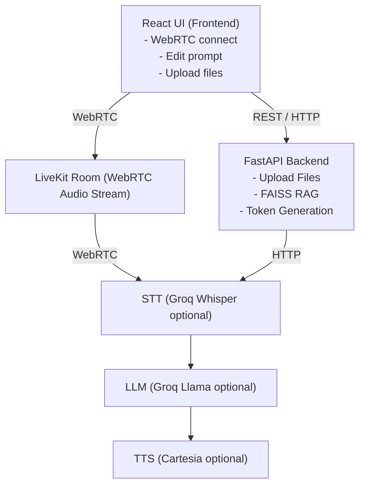

# Voice RAG Agent

Real-time voice AI agent where you can talk over WebRTC (LiveKit) and get answers using RAG over uploaded documents during the call.

## Features

- **Voice over WebRTC**: Real-time voice conversation using LiveKit
- **Speech-to-Text**: Groq Whisper (free)
- **LLM**: Groq Llama (free)
- **Text-to-Speech**: Cartesia (optional) or text-only mode
- **RAG**: Upload PDF, CSV, TXT, MD files - agent retrieves relevant chunks and answers from them
- **React Frontend**: WebRTC connect, editable system prompt, document upload, live transcript, RAG sources panel

## Architectural Flow



## Prerequisites

- Python 3.12+
- Node.js 18+
- LiveKit Cloud account (free tier available)
- Groq API key (free)

## Installation & Running

### Windows 11

Open **3 separate terminals**:

**Terminal 1 - Backend:**
```powershell
cd C:\path\to\voice-rag-agent

python -m venv .venv
.venv\Scripts\activate

pip install -r requirements.txt
python backend\main.py
```

**Terminal 2 - Agent:**
```powershell
cd C:\path\to\voice-rag-agent\agent
python agent.py dev
```

**Terminal 3 - Frontend:**
```powershell
cd C:\path\to\voice-rag-agent\frontend

npm install
npm run dev
```

### Linux/macOS

Open **3 separate terminals**:

**Terminal 1 - Backend:**
```bash
cd /path/to/voice-rag-agent

python3 -m venv .venv
source .venv/bin/activate

pip install -r requirements.txt
python3 backend/main.py
```

**Terminal 2 - Agent:**
```bash
cd /path/to/voice-rag-agent/agent
source ../.venv/bin/activate
python3 agent.py dev
```

**Terminal 3 - Frontend:**
```bash
cd /path/to/voice-rag-agent/frontend
npm install
npm run dev
```

## Environment Setup

Create `.env` file in `backend/` directory:

```env
# LiveKit (from your LiveKit Cloud dashboard)
LIVEKIT_URL=wss://your-project.livekit.cloud
LIVEKIT_API_KEY=your_api_key
LIVEKIT_API_SECRET=your_api_secret
RAG_BACKEND_URL="http://localhost:8000"

# Optional - Cartesia TTS (free tier available)
GROQ_API_KEY=your_groq_key
CARTESIA_API_KEY=your_cartesia_key
```

## How It Works

1. **Upload Documents**: Upload PDF, CSV, TXT, or MD files via the web UI
2. **Indexing**: Documents are chunked and embedded using sentence-transformers, stored in FAISS
3. **Start Call**: Click "Start Call" to join the LiveKit room
4. **Speak**: Click "Start Talking" and ask questions
5. **Agent Response**:
   - Your speech → Groq STT → Text
   - Text query → FAISS retrieval → Relevant chunks
   - Chunks + Query → Groq LLM → Answer
   - Answer → Transcript display + (optional) TTS

## Project Structure
```
VOICE-RAG-AGENT/
│
├── agent/
│   ├── __init__.py
│   └── agent.py
│
├── backend/
│   ├── __init__.py
│   ├── config.py
│   ├── main.py
│   └── rag.py
│
├── frontend/
│   ├── src/
│   │   ├── api.js
│   │   ├── App.jsx
│   │   ├── main.jsx
│   │   └── VoiceRoom.jsx
│   │
│   ├── index.html
│   ├── package.json
│   ├── package-lock.json
│   └── vite.config.js
│
├── .env.example
├── .gitignore
├── LICENSE
├── README.md
├── requirements.txt
└── sample-doc.txt
```

## API Endpoints

| Endpoint | Method | Description |
|----------|--------|-------------|
| `/upload` | POST | Upload document for RAG |
| `/ragStatus` | GET | Get RAG indexing status |
| `/retrieve` | POST | Retrieve relevant chunks |
| `/getToken` | POST | Get LiveKit token |
| `/health` | GET | Health check |

## Usage

1. Open http://localhost:3000 in your browser
2. Upload documents (PDF, CSV, TXT, MD supported)
3. Wait for "Document is ready" message
4. Click "Start Call"
5. Click "Start Talking" and speak
6. See transcript and RAG sources in real-time

## Troubleshooting

- **No transcript showing**: Ensure agent is running (`python agent.py dev`)
- **Documents not indexing**: Check backend console for parsing errors
- **Connection issues**: Verify LiveKit credentials in .env

## License

MIT
