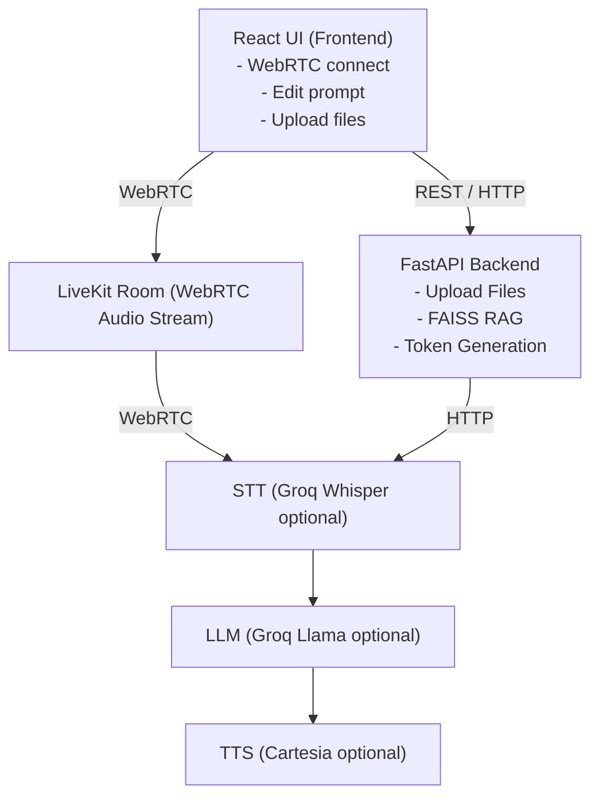

# 🎙️ Voice RAG Agent

Real-time voice AI agent where you can talk over WebRTC using LiveKit and get answers powered by Retrieval-Augmented Generation (RAG) over your uploaded documents — during the call.

[](https://deepwiki.com/ManojKumarKarumanchi/voice-rag-agent)
---
## 🚀 Features

* **Voice over WebRTC** – Real-time voice conversation via LiveKit
* **Speech-to-Text (STT)** – Groq Whisper (free tier)
* **LLM** – Groq LLaMA models (free tier)
* **Text-to-Speech (TTS)** – Cartesia (optional) or text-only mode
* **RAG Pipeline** – Upload PDF, CSV, TXT, MD files
* **Vector Search** – FAISS-based semantic retrieval
* **Modern Frontend** – React + Vite
* **Live Transcript & Sources Panel** – See retrieved chunks in real time
* **Editable System Prompt** – Modify agent behavior on the fly

---

## 🏗 Architecture



---

## 🧠 Embedding & RAG Setup

We use:

* **Sentence Transformers**
* **LangChain RecursiveCharacterTextSplitter**
* **FAISS vector store**
* **PyPDF fallback loader**

```python
from sentence_transformers import SentenceTransformer
from langchain.text_splitter import RecursiveCharacterTextSplitter

embed_model = SentenceTransformer("BAAI/bge-small-en")

splitter = RecursiveCharacterTextSplitter(
    chunk_size=500,
    chunk_overlap=50
)
```

### Embedding Model

* `BAAI/bge-small-en`
* Lightweight and optimized for semantic retrieval
* Ideal for local + production RAG setups

---

## 🛠 Tech Stack

### Backend

* FastAPI
* FAISS (vector search)
* Sentence Transformers
* LangChain text splitters
* PyPDF (fallback document loader)

### Real-Time Layer

* LiveKit (WebRTC audio rooms)

### AI Services

* Groq (Whisper STT + LLaMA inference)
* Cartesia (optional TTS)

### Frontend

* React
* Vite
* WebRTC

---

## 📋 Prerequisites

* Python 3.12+
* Node.js 18+
* LiveKit Cloud account (free tier available)
* Groq API key (free tier available)

---

# ⚙️ Installation & Running

You must run **3 services**:

1. Backend
2. Agent
3. Frontend

---

## 🪟 Windows 11

Open **3 separate terminals**:

### Terminal 1 – Backend

```powershell
cd C:\path\to\voice-rag-agent

python -m venv .venv
.venv\Scripts\activate

pip install -r requirements.txt
python backend\main.py
```

### Terminal 2 – Agent

```powershell
cd C:\path\to\voice-rag-agent\agent
python agent.py dev
```

### Terminal 3 – Frontend

```powershell
cd C:\path\to\voice-rag-agent\frontend

npm install
npm run dev
```

---

## 🐧 Linux / macOS

Open **3 separate terminals**:

### Terminal 1 – Backend

```bash
cd /path/to/voice-rag-agent

python3 -m venv .venv
source .venv/bin/activate

pip install -r requirements.txt
python3 backend/main.py
```

### Terminal 2 – Agent

```bash
cd /path/to/voice-rag-agent/agent
source ../.venv/bin/activate
python3 agent.py dev
```

### Terminal 3 – Frontend

```bash
cd /path/to/voice-rag-agent/frontend
npm install
npm run dev
```

---

# 🔐 Environment Setup

Create `.env` file inside `backend/`:

```env
# LiveKit
LIVEKIT_URL=wss://your-project.livekit.cloud
LIVEKIT_API_KEY=your_api_key
LIVEKIT_API_SECRET=your_api_secret

RAG_BACKEND_URL=http://localhost:8000

# AI Services
GROQ_API_KEY=your_groq_key
CARTESIA_API_KEY=your_cartesia_key
```

---

# 📂 Project Structure

```
VOICE-RAG-AGENT/
│
├── agent/
│   ├── __init__.py
│   └── agent.py
│
├── backend/
│   ├── __init__.py
│   ├── config.py
│   ├── main.py
│   └── rag.py
│
├── frontend/
│   ├── src/
│   │   ├── api.js
│   │   ├── App.jsx
│   │   ├── main.jsx
│   │   └── VoiceRoom.jsx
│   │
│   ├── index.html
│   ├── package.json
│   ├── vite.config.js
│
├── .env.example
├── .gitignore
├── LICENSE
├── README.md
├── requirements.txt
└── sample-doc.txt
```

---

# 🔌 API Endpoints

| Endpoint     | Method | Description              |
| ------------ | ------ | ------------------------ |
| `/upload`    | POST   | Upload document for RAG  |
| `/ragStatus` | GET    | Get indexing status      |
| `/retrieve`  | POST   | Retrieve relevant chunks |
| `/getToken`  | POST   | Generate LiveKit token   |
| `/health`    | GET    | Health check             |

---

# ▶️ Usage

1. Open `http://localhost:3000`
2. Upload documents (PDF, CSV, TXT, MD supported)
3. Wait for "Document is ready"
4. Click **Start Call**
5. Click **Start Talking**
6. Ask questions — see:

   * Live transcript
   * Retrieved sources
   * AI response (text or voice)

---

# 🔎 How It Works

1. **Upload Document**
   Files are parsed (PyPDF fallback supported).

2. **Chunking & Embedding**

   * Split into overlapping chunks
   * Embedded using BGE model
   * Stored in FAISS

3. **Voice Interaction Flow**

   * Speech → Groq Whisper → Text
   * Text → FAISS Retrieval
   * Retrieved Chunks + Query → Groq LLM
   * Response → Transcript + Optional TTS

---

# 🛠 Troubleshooting

**No transcript showing**

* Ensure agent is running:

  ```bash
  python agent.py dev
  ```

**Documents not indexing**

* Check backend console logs
* Verify file format support

**Connection issues**

* Confirm LiveKit credentials in `.env`
* Ensure backend is running on port 8000

---
Demo: https://tinyurl.com/voicerag
---
# 📜 License

MIT
